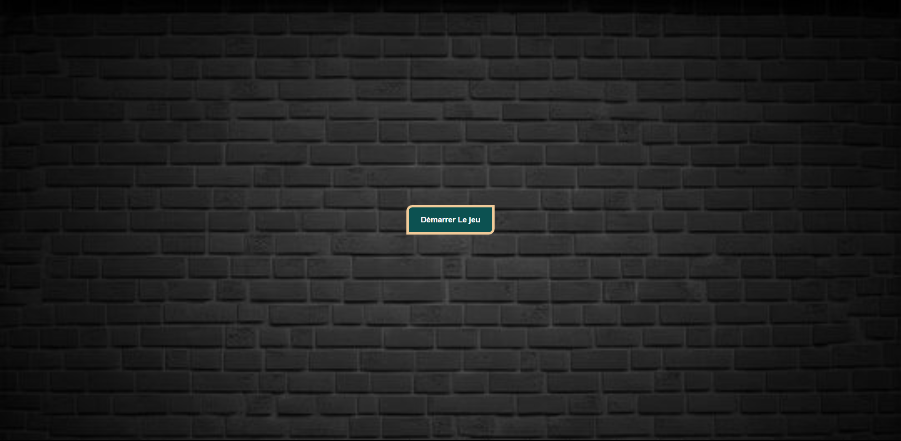
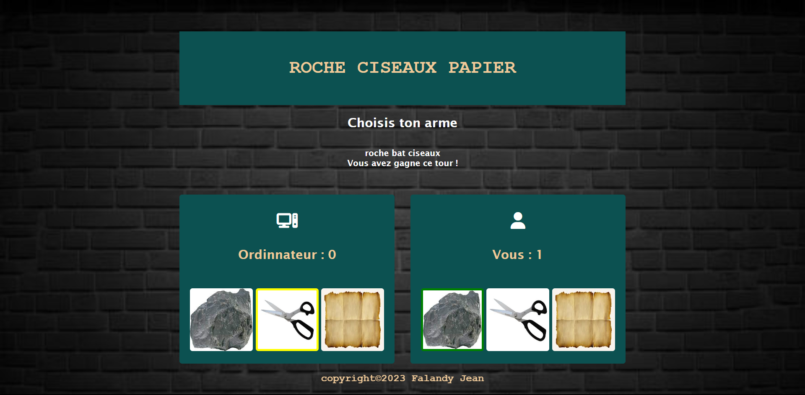

# Ciseaux Saga

Bienvenue dans Ciseaux Saga, un jeu de roche-papier-ciseaux passionnant et facile à jouer.

## Présentation

Ciseaux Saga offre une expérience ludique du célèbre jeu de roche-papier-ciseaux. Affrontez l'ordinateur, choisissez votre arme avec soin et remportez des victoires épiques pour devenir le maître de Ciseaux Saga.

## Comment jouer

1. **Démarrer le jeu :** Cliquez sur le bouton "Démarrer le jeu" pour lancer l'aventure.

2. **Choisir votre arme :** Sélectionnez votre arme préférée parmi les options de roche, papier ou ciseaux.

3. **Affrontez l'ordinateur :** L'ordinateur fera son choix, et le résultat sera annoncé avec des effets sonores excitants.

4. **Gagner des points :** Accumulez des points en battant l'ordinateur avec des combinaisons stratégiques.

5. **Gagner la partie :** Soyez le premier à atteindre 5 points pour remporter la partie.

## Exécution locale

##Technologies utilisées
HTML
CSS
JavaScript
##Auteur
Falandy Jean
